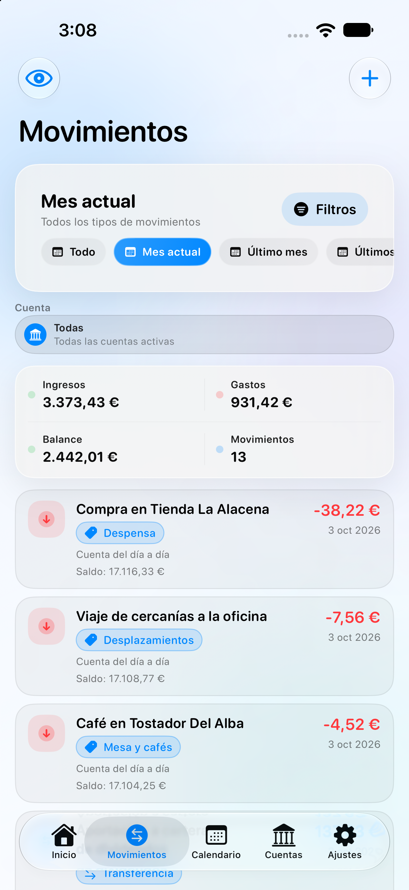
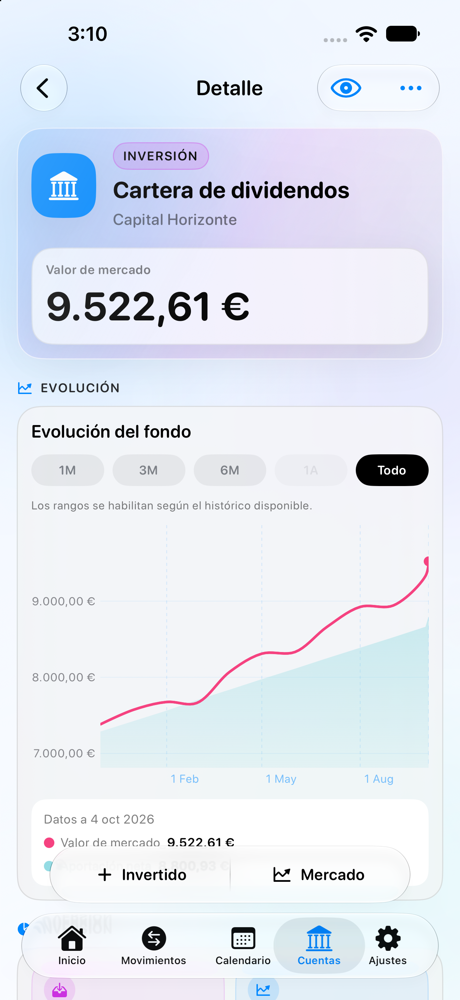
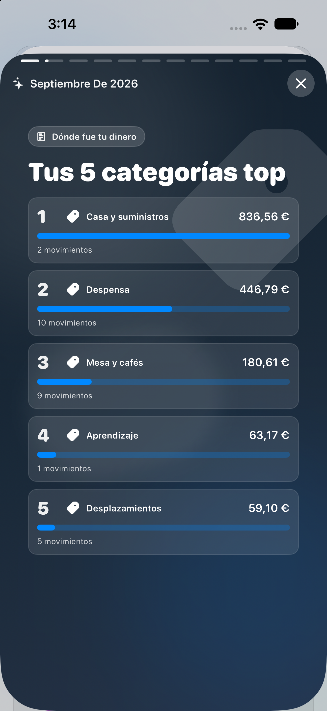

# Finance (iOS)


Aplicacion iOS para gestionar patrimonio financiero personal de forma local: cuentas bancarias, movimientos, presupuestos y analitica.

## Objetivo

- Llevar control manual de cuentas, saldos y movimientos
- Entender ingresos, gastos, patrimonio e inversiones con analitica visual
- Mantener privacidad total (sin backend ni sincronizacion con terceros)

## Stack tecnico

- SwiftUI
- SwiftData
- Swift Charts
- WidgetKit + App Intents
- Xcode (iOS 26.2+)

## Funcionalidades actuales

- Cuentas, bancos y patrimonio
  - Alta, edicion y eliminacion de cuentas y bancos
  - Tipos de cuenta (corriente, ahorro, inversion, etc.)
  - Banco con icono y color personalizado
  - Moneda global configurable para toda la app
  - Modo ocultar/mostrar saldos

- Movimientos
  - Registro de ingresos, gastos y transferencias entre cuentas
  - Edicion y eliminacion con ajuste de saldos
  - Filtros por cuenta, tipo, categoria, periodo y buscador avanzado
  - Vista detalle rica del movimiento (incluye cambios rapidos)

- Gastos compartidos y reembolsos
  - Definir "mi parte" en gastos compartidos
  - Registro de ingresos como reembolso vinculados al gasto origen
  - Seguimiento de recuperado, pendiente y exceso
  - Lista de reembolsos pendientes desde Inicio

- Recurrentes
  - Crear ingresos/gastos recurrentes (semanal, mensual o anual)
  - Confirmacion manual de ocurrencias para impactar saldo
  - Gestion visual en calendario con estados (vencido, hoy, pendiente, confirmado)

- Presupuesto mensual
  - Presupuesto unico con distribucion por categorias
  - Progreso global y por categoria
  - Alertas locales al 80 % y 100 %
  - Vista de detalle con desglose por categoria

- Estadisticas y Wrapped
  - Ambitos de estadisticas: Movimientos e Inversiones
  - Comparativas entre periodos y evolucion mensual
  - Graficos por categoria para ingresos y gastos
  - KPIs de inversion (invertido, mercado, rentabilidad y rentabilidad %)
  - Wrapped mensual con historial y experiencia tipo stories

- Inversiones
  - Campos de cantidad invertida y valor de mercado por cuenta de inversion
  - Snapshots diarios para construir historico
  - Evolucion temporal agregada y desglose por cuenta
  - Recordatorio local de actualizacion de inversiones (L-V)

- Exportacion, importacion y backups
  - Exportar/importar JSON versionado con compatibilidad retroactiva
  - Importacion en modo "sumar" o "reemplazar"
  - Sincronizacion manual con carpeta de iCloud Drive
  - Retencion automatica de las 2 ultimas copias en iCloud Drive
  - Backup automatico diario configurable por hora (best effort en iOS)
  - Aviso al abrir la app si existe una copia mas reciente en iCloud Drive

- Widget y atajos
  - Widget para anadir gasto rapido
  - Deep link `finance://add-expense`
  - Shortcut/App Intent para registrar gastos desde Atajos/Siri

## Privacidad

- Sin APIs de bancos ni servicios de terceros
- Sin analitica externa
- Persistencia local en dispositivo mediante SwiftData
- Control total del usuario sobre export/import y backups

## Estructura del proyecto

```text
Finance/
  README.md
  docs/
  Finance/
    FinanceApp.swift
    ContentView.swift
    Models/
      BankAccount.swift
      Movement.swift
      RecurringMovement.swift
      Budget.swift
      BudgetItem.swift
      InvestmentSnapshot.swift
      ...
    Views/
      ChartsView.swift
      MovementsView.swift
      RecurringCalendarView.swift
      AccountListView.swift
      SettingsView.swift
      MovementStatsView.swift
      MonthlyWrappedHistoryView.swift
      PendingReimbursementsListView.swift
      AddMovementView.swift
      AddBudgetView.swift
      ...
    Services/
      DataExportService.swift
      ManualSyncService.swift
      AutoBackupService.swift
      RecurringMovementService.swift
      BudgetService.swift
      MonthlyWrappedService.swift
      ...
    Intents/
      AddExpenseIntent.swift
      BankAccountEntity.swift
      MovementCategoryEntity.swift
    Utilities/
      AppCurrency.swift
      AppVersion.swift
      DeepLinkRouter.swift
      ...
  FinanceWidget/
    QuickExpenseWidget.swift
    FinanceWidgetBundle.swift
```

## Ejecutar en local

1. Abrir `Finance.xcodeproj` en Xcode
2. Seleccionar un simulador iOS
3. `Cmd + R`

Si cambias modelos de SwiftData y hay inconsistencias de esquema:

- `Product > Clean Build Folder`
- Borrar la app del simulador
- Ejecutar de nuevo

## Formato de numeros

La aplicacion usa formato monetario con:

- Separador de miles: `.`
- Separador decimal: `,`
- Ejemplo: `12.345,67 EUR`

## Roadmap (proximos pasos)

- Mejoras de UX y rendimiento en pantallas con listas y filtros largos
- Ampliar analitica comparativa entre periodos (tendencias y variaciones)
- Mayor automatizacion para seguimiento de inversiones

---

Proyecto personal en evolucion, enfocado en simplicidad, privacidad y control local de datos.

## Distribución con SideStore

La fuente de Finance está en:

`https://ismaelp19.github.io/finance/source.json`

El repositorio ya es público. GitHub Pages está configurado con **GitHub Actions** y el entorno `github-pages` admite despliegues desde `release/*`.

La primera versión de `release/1` se creó desde `develop`. Para publicar las siguientes:

1. Confirmar y publicar los cambios en `develop`.
2. Aplicar en `release/1` los commits deseados de `develop` mediante `git cherry-pick` y hacer push de `release/1`.
3. Esperar a que terminen los jobs `build` y `deploy` del workflow **Publicar en SideStore**. Cada push a una rama `release/*` genera una nueva versión en la fuente.

El workflow archiva Finance para dispositivo sin firma de distribución, incluye `FinanceWidgetExtension.appex` en `Payload/Finance.app`, genera `Finance.ipa`, lo publica como asset de una GitHub Release y actualiza el JSON en GitHub Pages. Guarda también el JSON junto al IPA en la Release para conservar el historial de versiones. Usa `AppVersion.current` como base y asigna al IPA una versión mayor que la última publicada; también actualiza la versión visible de Ajustes dentro de esa compilación. El build cambia con cada nuevo push. Se conserva el bundle ID `com.getincouch.Finance`.

Para añadir Finance en un iPhone con SideStore ya instalado:

1. Abrir **SideStore → Sources → +** y añadir `https://ismaelp19.github.io/finance/source.json`. También se puede abrir [el enlace directo a la fuente](sidestore://source?url=https%3A%2F%2Fismaelp19.github.io%2Ffinance%2Fsource.json) desde el iPhone.
2. Instalar Finance desde esa fuente. Al preguntar por la extensión, conservar `FinanceWidgetExtension` si se quiere usar el widget.
3. Cuando aparezca una nueva versión, pulsar **Update** en SideStore con LocalDevVPN conectado. Publicar un push hace disponible la actualización; cada usuario decide cuándo instalarla.

Con un Apple ID gratuito, SideStore vuelve a firmar la app en cada dispositivo: hay que refrescarla antes de que pasen siete días y se aplica el límite de tres apps activas, contando SideStore. No se usa el flujo **Distribute App** de Xcode ni se necesita Apple Developer Program de pago. [Documentación de fuentes de SideStore](https://docs.sidestore.io/docs/advanced/app-sources) · [Preguntas frecuentes de SideStore](https://docs.sidestore.io/docs/faq).

El IPA probado actualmente exige iOS 26.2 o posterior. La fuente declarará el mínimo de iOS del IPA publicado.

### Ficha de Finance en SideStore

La fuente incluye una descripción de las funciones actuales y una galería de la app. La documentación completa de uso y distribución está en este repositorio, enlazado desde la fuente. El generador `scripts/update_sidestore_source.py` incorpora estos contenidos al JSON; el workflow publica también el icono y las capturas en GitHub Pages.

| Inicio: cuentas y resumen | Movimientos: registro diario |
| --- | --- |
|  |  |

| Inversiones: evolución de la cartera | Wrapped: resumen de septiembre |
| --- | --- |
|  |  |

Las capturas proceden del simulador iPhone 16 Pro Max (iOS 27), a 1320 × 2868 píxeles, y se actualizaron el 4 de octubre de 2026. Todos los datos son inventados para representar un uso cotidiano: cuentas, movimientos e importes son de demostración. Son referencias visuales y pueden diferir de la última versión publicada. Consulta [las instrucciones de capturas](docs/screenshots/README.md) para actualizarlas.

### Qué significa el número entre paréntesis

En etiquetas como `1.3.4 (35)`, `1.3.4` es la versión de Finance y `35` es el número de compilación o **build**. SideStore puede añadir ese build al mostrar una versión que lo declara. No indica un error ni el número de actualizaciones pendientes.

La fuente conserva `buildVersion`, que coincide con `CFBundleVersion` dentro del IPA, para identificar las compilaciones y gestionar las actualizaciones. Cambiar el título de una GitHub Release o la descripción de la ficha no elimina el sufijo que SideStore añade en su propia interfaz. Las nuevas Releases se titulan `Finance <versión>` y las notas generadas de cada versión omiten el build, sin afirmar cambios que el generador no puede verificar.

Estos cambios de la ficha se hacen públicos cuando se publica un push a `release/*` y termina el despliegue de Pages. Después puede ser necesario actualizar las fuentes en SideStore para ver la descripción y las capturas nuevas.
