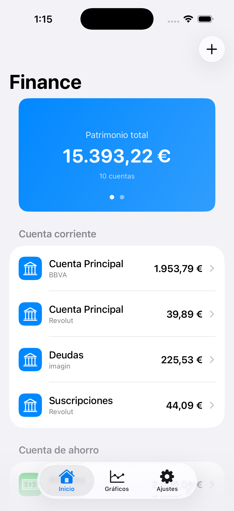
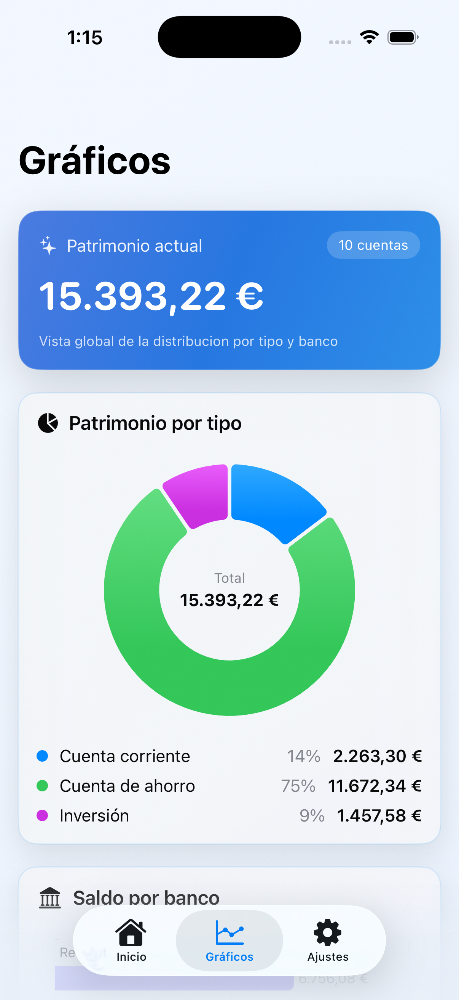
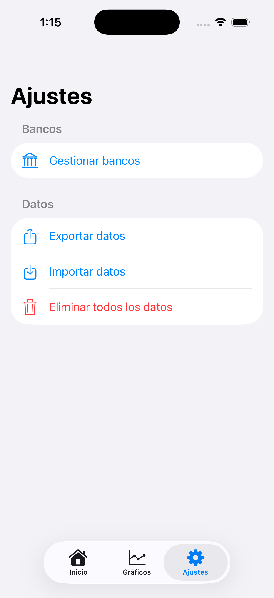

# Finance (iOS)


Aplicacion iOS para gestionar patrimonio financiero personal de forma local: cuentas bancarias, saldos y analitica visual.

## Capturas






## Objetivo

- Llevar control manual de saldos por cuenta y banco
- Ver patrimonio total y desglose por tipo de cuenta
- Mantener privacidad total (sin backend ni sincronizacion externa)

## Stack tecnico

- SwiftUI
- SwiftData
- Swift Charts
- Xcode (iOS 17+)

## Funcionalidades actuales

- Cuentas, bancos y patrimonio
  - Alta, edicion y eliminacion de cuentas y bancos
  - Tipos de cuenta (corriente, ahorro, inversion, etc.)
  - Banco con icono y color personalizado
  - Moneda global configurable para toda la app
- Movimientos
  - Registro de ingresos, gastos y transferencias entre cuentas
  - Edicion y eliminacion con ajuste de saldos
  - Filtros por tipo/categoria y buscador de movimientos
- Categorias
  - Gestion completa de categorias (crear, editar, eliminar)
  - Categoria con icono y color
- Estadisticas
  - Analitica en una sola pantalla con dos ambitos: Movimientos e Inversiones
  - Filtros temporales (mes actual, ultimo mes, ultimos 3 meses, ano actual, ano anterior, personalizado y todo)
  - Graficos por categoria para ingresos y gastos
  - KPIs de inversion (invertido, mercado, rentabilidad y rentabilidad %)
  - Evolucion historica de inversiones y desglose por cuenta
- Inversiones
  - Campos de cantidad invertida y valor de mercado por cuenta de inversion
  - Actualizacion manual con fecha seleccionable para completar historico
  - Snapshots diarios para construir series temporales
  - Recordatorio local de actualizacion de inversiones de lunes a viernes
- Exportacion, importacion y sync manual
  - Exportar/importar JSON con compatibilidad retroactiva entre versiones
  - Modo de importacion: mantener datos actuales o reemplazar
  - Backup manual en iCloud Drive con retencion automatica de las 2 ultimas copias
  - Backup automatico diario configurable por hora (modo best effort en iOS)
  - Aviso al abrir la app si existe una copia mas reciente en iCloud Drive
- App Icon
  - Variantes light/dark/tinted

## Privacidad y RGPD

- Sin llamadas de red para datos financieros
- Sin APIs de bancos
- Sin analitica de terceros
- Persistencia local en dispositivo mediante SwiftData
- Export/import manual controlado por el usuario

## Estructura del proyecto

```text
Finance/
  README.md
  docs/
    screenshots/
      home.png
      charts.png
      settings.png
  Finance/
    FinanceApp.swift
    ContentView.swift
    Models/
      AccountType.swift
      Bank.swift
      BankAccount.swift
      BankColor.swift
      BankIcon.swift
      Movement.swift
      MovementCategory.swift
      MovementType.swift
      InvestmentSnapshot.swift
    Views/
      AccountListView.swift
      AddAccountView.swift
      AccountDetailView.swift
      MovementsView.swift
      AddMovementView.swift
      MovementStatsView.swift
      ChartsView.swift
      BankManagementView.swift
      CategoryManagementView.swift
      SettingsView.swift
      Charts/
        PatrimonyPieChart.swift
        BalanceByBankBarChart.swift
        CategoryPieChart.swift
        CategoryAmountBarChart.swift
      Components/
        AccountRowView.swift
        TotalBalanceCard.swift
        BalanceByTypeCard.swift
        CategoryChipView.swift
        InvestmentPerformanceCard.swift
    Services/
      DataExportService.swift
      ManualSyncService.swift
      InvestmentReminderService.swift
    Utilities/
      CurrencyFormatter.swift
      AppDateFormatter.swift
      AppCurrency.swift
```

## Ejecutar en local

1. Abrir `Finance.xcodeproj` en Xcode
2. Seleccionar un simulador iOS
3. `Cmd + R`

Si cambias modelos de SwiftData y hay inconsistencias de esquema en pruebas:

- `Product > Clean Build Folder`
- Borrar la app del simulador
- Ejecutar de nuevo

## Formato de numeros

La aplicacion usa este formato monetario:

- Separador de miles: `.`
- Separador decimal: `,`
- Ejemplo: `12.345,67 €`

## Roadmap (proximos pasos)

- Mejoras de UX y pulido visual en estadisticas y movimientos
- Filtros avanzados y comparativas entre periodos
- Mas automatizaciones alrededor de inversiones (alertas y seguimiento)

---

Proyecto personal en evolucion. Enfocado en simplicidad, privacidad y control local de datos.
