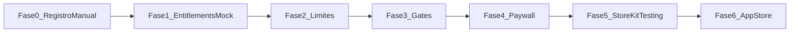

# Objetivos a largo plazo — Finance

> Este documento recoge objetivos de producto a largo plazo. No representa trabajo inmediato ni funcionalidades actualmente comprometidas.
>
> El modelo Free/Pro y la funcionalidad Grupos quedan deliberadamente fuera del roadmap operativo actual. Grupos tiene su especificación independiente en [`GROUPS.md`](../GROUPS.md).

## Alcance a largo plazo

Los objetivos recogidos aquí podrán retomarse cuando la experiencia financiera básica, la consistencia de datos y la recuperación de copias estén suficientemente estabilizadas:

- Modelo de suscripción Finance Free vs Finance Pro.
- Límites de uso, entitlements, paywall y StoreKit.
- Mejoras de conversión, automatización y capacidades avanzadas.

La prioridad actual sigue siendo mantener una aplicación local-first fiable, portable y segura para los datos del usuario.

---

## Modelo de suscripción — Finance Free vs Finance Pro

> Documento de referencia para el modelo freemium de Finance.
> Versión de app de referencia: **0.6.74** · Última actualización: mayo 2026

---

## Filosofía del modelo

Finance es una app de finanzas personales **100 % local** (SwiftData, sin backend, sin Open Banking). El objetivo del modelo Free vs Pro:

| Tier | Propósito |
|------|-----------|
| **Finance Free** | Una **app básica real**, no una demo bloqueada. Debe permitir crear **hábito**, **confiar** en la app y cubrir el día a día de la mayoría de usuarios ocasionales. |
| **Finance Pro** | La versión **potente** para quien quiere **histórico completo**, **automatización**, **análisis avanzado** y **control fino**. |

### Lo que Pro vende (y lo que no)

| Pro vende | Pro NO vende |
|-----------|--------------|
| Control y comodidad | Privacidad |
| Automatización | Acceso a tus propios datos |
| Analítica avanzada | Exportar o respaldar |
| Histórico completo | El modelo local-first |

Free y Pro son **igual de local-first**. La suscripción desbloquea capacidades, no retira derechos sobre los datos del usuario.

---

## Siempre gratis (innegociable)

Estas funcionalidades **nunca** van detrás del paywall:

- Ver **saldo actual** y patrimonio agregado.
- **Registrar, editar y eliminar** movimientos dentro del periodo permitido.
- **Exportar JSON** (portabilidad total).
- **Importar JSON** (migración y restauración).
- **Eliminar todos los datos** (control del usuario).
- **Backup manual** a iCloud Drive.
- Acceso básico a los datos propios **sin sensación de secuestro**.

> Mensaje clave en cualquier límite: *"Tus datos siguen guardados en tu dispositivo y puedes exportarlos cuando quieras."*

---

## Finance Free

### Límites cuantitativos

| Recurso | Límite Free |
|---------|-------------|
| Cuentas activas | **3** |
| Categorías | **10** |
| Historial de movimientos (editable) | **6 meses** (semestre) |
| Reglas recurrentes | **3** |
| Cuentas de inversión | **1** |
| Histórico gráfico inversión | **3 meses** |
| Presupuesto | **1 presupuesto mensual global simple** |
| Wrapped | **Mes anterior** |

### Cuentas y organización

| Funcionalidad | Detalle Free |
|---------------|--------------|
| CRUD cuentas | Hasta 3 activas |
| Tipos de cuenta | Todos (corriente, ahorro, inversión, tarjeta, efectivo) |
| Archivar cuentas | Sí |
| CRUD bancos | Sí (icono y color) |
| Moneda global | Sí (EUR, USD, GBP, JPY) |
| Ocultar / mostrar saldos | Sí |

### Movimientos

| Funcionalidad | Detalle Free |
|---------------|--------------|
| CRUD dentro del semestre | Sí (gasto, ingreso, transferencia) |
| Filtros básicos | Por cuenta, tipo y periodo (dentro del semestre) |
| Búsqueda por concepto | Sí (dentro del semestre) |
| Resumen del periodo | Sí |
| Pickers rápidos cuenta / categoría | Sí |
| Crear categoría inline | Sí (si < 10 categorías) |
| Historial > 6 meses | Ver **resumen agregado** (totales por mes/año); **sin** detalle ni edición → ver [UX histórico](#ux-del-histórico-limitado-free) |

### Movimientos recurrentes

| Funcionalidad | Detalle Free |
|---------------|--------------|
| Reglas activas | Hasta **3** |
| Calendario | Sí, para las 3 reglas |
| Confirmar / cancelar ocurrencias | Sí |
| Badge de pendientes | Sí |

### Presupuesto mensual

| Funcionalidad | Detalle Free |
|---------------|--------------|
| 1 presupuesto mensual global | Sí — importe total del mes |
| Progreso global (barra) | Sí |
| Distribución por categorías | No |
| Progreso por categoría | No |
| Alertas visuales ≥ 80 % | No |
| Notificaciones 80 % / 100 % | No |
| Detalle con desglose por categoría | No |
| Histórico de presupuestos pasados | No |

> Free permite **controlar el gasto total del mes**; Pro permite **controlar dónde se va**.

### Dashboard (Inicio)

| Funcionalidad | Detalle Free |
|---------------|--------------|
| Patrimonio total (hero) | Sí |
| Gráfico patrimonio por tipo (pie) | Sí |
| Gráfico saldo por banco (barras) | Sí |
| Sección presupuesto global simple | Sí |
| Tarjetas KPI por tipo | Preview limitada o no |
| Banner Wrapped (mes anterior) | Sí |
| Acceso estadísticas | Preview promocional → ver [Estadísticas](#estadísticas) |
| Reembolsos pendientes | No |

### Estadísticas

| Funcionalidad | Detalle Free |
|---------------|--------------|
| Vista completa de estadísticas | No |
| Preview del mes actual | Sí — KPIs básicos (ingresos, gastos, neto del mes) |
| Gráficos comparativos | Preview estática o con datos de ejemplo atenuados |
| CTA claro hacia Pro | Sí — *"Desbloquea comparativas, tendencias e inversión"* |

### Inversiones

| Funcionalidad | Detalle Free |
|---------------|--------------|
| Cuentas de inversión | 1 |
| Saldo actual (invertido / mercado / rentabilidad) | Sí |
| Gráfico histórico | Sí, **3 meses** |
| Actualizar cantidades manualmente | Sí |
| Recordatorio L-V | No |
| Rendimiento agregado (listado) | No |

### Wrapped mensual

| Funcionalidad | Detalle Free |
|---------------|--------------|
| Wrapped del mes anterior | Sí (experiencia completa) |
| Historial de meses | No |
| Recordatorio mensual | No |

### Gastos compartidos y reembolsos

| Funcionalidad | Detalle Free |
|---------------|--------------|
| Gastos compartidos | No |
| Reembolsos vinculados | No |
| Lista reembolsos pendientes | No |

### Datos y respaldo

| Funcionalidad | Detalle Free |
|---------------|--------------|
| Export JSON | Sí |
| Import JSON (sumar / reemplazar) | Sí |
| Eliminar todos los datos | Sí |
| Backup manual iCloud | Sí (sync best effort) |
| Retención 2 copias | Sí |
| Backup automático diario | No |
| Aviso copia más reciente al abrir | No |

### Integraciones

| Funcionalidad | Detalle Free |
|---------------|--------------|
| Deep link `finance://add-expense` | **Sí** |
| Widget básico "Añadir gasto" | **Sí** |
| Atajos / Siri básicos (registrar gasto) | **Sí** |
| Plantillas de movimientos frecuentes | No |
| Automatizaciones avanzadas de Shortcuts | No |
| Duplicar movimiento rápido | No (Pro) — ver [Prioridad producto](#prioridad-de-producto-antes-del-paywall) |

---

## Finance Pro

Incluye **todo lo de Finance Free sin límites**, más:

### Desbloqueos principales

| Área | Qué añade Pro |
|------|---------------|
| Cuentas | Ilimitadas |
| Categorías | Ilimitadas |
| Movimientos | Historial **completo** editable; filtros avanzados (multi-categoría, periodos custom, comparativas) |
| Recurrentes | Ilimitados + calendario completo |
| Presupuesto | Distribución por categorías, progreso por categoría, alertas visuales, notificaciones 80/100 %, detalle, histórico |
| Estadísticas | Vista completa: comparativas, tasa de ahorro, evolución mensual, gráficos por categoría, KPIs inversión |
| Inversiones | Ilimitadas, histórico completo, recordatorio L-V, rendimiento agregado |
| Reembolsos | Gastos compartidos, seguimiento, lista pendientes |
| Wrapped | Historial completo + recordatorio mensual |
| Backup | Automático diario + aviso de copia más reciente |
| Integraciones | Plantillas, duplicar movimiento, automatizaciones avanzadas |
| Dashboard | KPIs completos, banner reembolsos |

---

## Matriz completa por funcionalidad

Leyenda: ✅ Incluido · 👁 Preview / limitado · ⚡ Con límite · 🔒 Bloqueado · 💎 Solo Pro

| ID | Funcionalidad | Free | Pro |
|----|---------------|------|-----|
| **A. Experiencia global** |
| A1 | Tab bar (5 pestañas) | ✅ | ✅ |
| A2 | Skeleton de carga | ✅ | ✅ |
| A3 | Ocultar / mostrar saldos | ✅ | ✅ |
| A4 | Diagnóstico de crash | ✅ | ✅ |
| A5 | Reparación de integridad | ✅ | ✅ |
| A6 | Tema glass | ✅ | ✅ |
| A7 | Haptics | ✅ | ✅ |
| A8 | Fechas en español | ✅ | ✅ |
| **B. Cuentas y bancos** |
| B1 | CRUD cuentas | ⚡ 3 máx. | ✅ |
| B2 | Tipos de cuenta | ✅ | ✅ |
| B3 | Listado + patrimonio total | ✅ | ✅ |
| B4 | Detalle de cuenta | ✅ | ✅ |
| B5 | Cuentas archivadas (solo lectura) | ✅ | ✅ |
| B6 | CRUD bancos | ✅ | ✅ |
| B7 | Moneda global | ✅ | ✅ |
| **C. Movimientos** |
| C1 | CRUD movimientos | ⚡ semestre | ✅ completo |
| C2 | Gasto / ingreso / transferencia | ✅ | ✅ |
| C3 | Ajuste automático de saldos | ✅ | ✅ |
| C4 | Filtro por cuenta | ✅ | ✅ |
| C5 | Filtro por tipo | ✅ | ✅ |
| C6 | Filtro multi-categoría | 🔒 | 💎 |
| C7 | Filtros y comparativas avanzadas | 🔒 | 💎 |
| C8 | Búsqueda por concepto | ⚡ semestre | ✅ |
| C9 | Paginación en listas | ✅ | ✅ |
| C10 | Resumen del periodo | ⚡ semestre | ✅ |
| C11 | Pickers rápidos | ✅ | ✅ |
| C12 | Crear categoría inline | ⚡ < 10 cat. | ✅ |
| C13 | Resumen histórico > 6 meses | 👁 agregado | ✅ detalle |
| C14 | Duplicar movimiento | 🔒 | 💎 |
| C15 | Plantillas de movimientos | 🔒 | 💎 |
| **D. Categorías** |
| D1 | CRUD categorías | ⚡ 10 máx. | ✅ |
| D2 | Asignar categoría | ✅ | ✅ |
| **E. Gastos compartidos** |
| E1–E4 | Compartidos y reembolsos | 🔒 | 💎 |
| E5 | Reparación reembolsos huérfanos | ✅ | ✅ |
| **F. Recurrentes** |
| F1–F8 | Reglas, calendario, confirmación | ⚡ 3 máx. | ✅ |
| **G. Presupuesto** |
| G1 | Presupuesto mensual global | ✅ simple | ✅ |
| G2 | Distribución por categorías | 🔒 | 💎 |
| G3 | Progreso por categoría | 🔒 | 💎 |
| G4 | Alertas visuales ≥ 80 % | 🔒 | 💎 |
| G5 | Notificaciones 80 % / 100 % | 🔒 | 💎 |
| G6 | Detalle por categoría | 🔒 | 💎 |
| G7 | Histórico de presupuestos | 🔒 | 💎 |
| **H. Dashboard** |
| H1 | Hero patrimonio | ✅ | ✅ |
| H2 | Pie por tipo | ✅ | ✅ |
| H3 | Barras por banco | ✅ | ✅ |
| H4 | KPIs por tipo | 👁 | 💎 |
| H5 | Sección presupuesto | ✅ global | 💎 completo |
| H6 | Reembolsos pendientes | 🔒 | 💎 |
| H7 | Banner Wrapped | ⚡ mes ant. | ✅ |
| H8 | Acceso estadísticas | 👁 preview | 💎 |
| H9 | Estado vacío | ✅ | ✅ |
| **I. Estadísticas** |
| I1 | KPIs mes actual | 👁 preview | 💎 |
| I2–I7 | Comparativas, gráficos, inversión | 🔒 | 💎 |
| **J. Wrapped** |
| J1–J2 | Resumen + stories mes anterior | ⚡ | ✅ |
| J3 | Historial de meses | 🔒 | 💎 |
| J5 | Recordatorio mensual | 🔒 | 💎 |
| **K. Inversiones** |
| K1–K5 | Saldo, gráfico, actualizar | ⚡ 1 cuenta / 3 meses | ✅ |
| K6–K7 | Recordatorio, rendimiento agregado | 🔒 | 💎 |
| **L. Datos y respaldo** |
| L1–L5 | Export, import, borrar, backup manual | ✅ | ✅ |
| L6–L7 | Backup auto, aviso copia | 🔒 | 💎 |
| **M. Integraciones** |
| M1 | Widget básico añadir gasto | ✅ | ✅ |
| M2 | Deep link add-expense | ✅ | ✅ |
| M3 | Siri / Atajos básicos | ✅ | ✅ |
| M4 | Automatizaciones avanzadas | 🔒 | 💎 |
| **N. Ajustes** |
| N1–N5 | Moneda, organización, datos, sync | ✅ | ✅ |

---

## Comparativa rápida

| Área | Finance Free | Finance Pro |
|------|--------------|-------------|
| Cuentas | 3 | Ilimitadas |
| Categorías | 10 | Ilimitadas |
| Movimientos editables | 6 meses | Completo |
| Histórico antiguo | Resumen agregado | Detalle + edición |
| Recurrentes | 3 | Ilimitados |
| Presupuesto | Global simple | Por categorías + alertas + notificaciones |
| Estadísticas | Preview mes actual | Completo + comparativas |
| Inversiones | 1 cuenta, gráfico 3 meses | Ilimitadas, histórico completo |
| Wrapped | Mes anterior | Historial completo |
| Reembolsos | — | Completo |
| Backup | Manual | Manual + automático |
| Widget / deep link / Siri básico | Sí | Sí |
| Export / import / borrar datos | Sí | Sí |

---

## UX del histórico limitado (Free)

Principio: **transparencia sin agresividad**. No usar blur que oculte datos; el usuario debe sentir que la app es honesta.

### Movimientos > 6 meses

1. **Lista principal**: solo movimientos editables del último semestre.
2. **Sección "Historial archivado"** al final de la lista o en filtro dedicado:
   - Filas con concepto, fecha, importe y categoría **visibles**.
   - Icono de candado discreto; tap abre sheet informativo, no detalle editable.
3. **Resumen agregado**: totales por mes/año en la sección archivada.
4. **Mensaje fijo** en la sección:

   > *Tienes X movimientos anteriores a 6 meses. Siguen guardados en tu dispositivo. Exporta cuando quieras o desbloquea Finance Pro para acceder al historial completo.*

5. **Sin blur agresivo** sobre importes legibles en resumen; el bloqueo es de **interacción** (editar, eliminar, filtros avanzados), no de ocultación.

### Downgrade (usuario cancela Pro)

| Situación | Comportamiento |
|-----------|----------------|
| Más cuentas que el límite Free | Cuentas excedentes → **solo lectura**; no se eliminan |
| Más categorías que 10 | Existentes conservadas; no crear nuevas hasta bajar o reactivar Pro |
| Más recurrentes que 3 | Reglas excedentes → **pausadas** (solo lectura); no se eliminan |
| Movimientos > 6 meses | Vuelven a modo resumen; editables solo en semestre |
| Presupuesto por categorías | Degrada a presupuesto global simple (conserva total; oculta desglose) |
| Datos | **Nunca eliminados** por downgrade |

---

## UX del paywall

### Indicadores de uso (siempre visibles cerca del límite)

- `2/3 cuentas`
- `7/10 categorías`
- `3/3 recurrentes`
- Barra de presupuesto global con enlace *"Desglosa por categorías con Pro"*

### Mensajes del paywall (tono)

| Contexto | Mensaje |
|----------|---------|
| 4.ª cuenta | *"Gestiona todas tus cuentas con Finance Pro"* |
| 11.ª categoría | *"Organiza sin límites con Finance Pro"* |
| Historial completo | *"Accede a todo tu historial. Tus datos ya están aquí."* |
| Presupuesto por categorías | *"Controla en qué se va tu dinero, categoría a categoría"* |
| Estadísticas | *"Compara periodos y descubre tendencias"* |

### Previews de valor Pro

- Estadísticas: mostrar KPIs del mes actual en Free; gráficos comparativos atenuados con CTA.
- Presupuesto: barra global funcional en Free; filas de categorías visibles pero bloqueadas con candado suave.
- Wrapped: mes anterior completo; miniaturas de meses anteriores con overlay *"Pro"*.

---

## Precios

### Lanzamiento inicial

| Plan | Precio |
|------|--------|
| Mensual | **3,99 €** |
| Anual | **24,99 €** (~48 % descuento vs mensual) |
| Prueba gratuita | **7 días** |

### Opción futura (solo si sigue local-first)

| Plan | Rango | Condición |
|------|-------|-----------|
| Lifetime (lanzamiento) | **39,99 – 59,99 €** | Solo si no genera costes recurrentes significativos (sin backend, sin sync cloud propio) |

> El lifetime es una palanca de early adopters, no el pilar del modelo. La suscripción anual es el plan recomendado por defecto en el paywall.

---

## Arquitectura técnica

### Principio: un solo proveedor de permisos

No repartir `if isPro` por toda la app. Toda vista y servicio consulta un único punto:

```
EntitlementService / SubscriptionService
        ↓
   PlanLimits (Free vs Pro)
        ↓
   ProFeatureGate.canUse(_ feature)
```

### Enum de features Pro

```swift
enum ProFeature {
    case unlimitedAccounts
    case unlimitedCategories
    case fullMovementHistory
    case advancedFilters
    case advancedStats
    case budgetByCategory
    case budgetNotifications
    case reimbursements
    case unlimitedRecurring
    case unlimitedInvestments
    case fullInvestmentHistory
    case investmentReminder
    case wrappedHistory
    case automaticBackup
    case backupRestorePrompt
    case movementTemplates
    case duplicateMovement
    case advancedShortcuts
}
```

### Modelo de límites por plan

```swift
struct PlanLimits {
    let maxActiveAccounts: Int?        // Free: 3, Pro: nil
    let maxCategories: Int?          // Free: 10, Pro: nil
    let maxRecurringRules: Int?      // Free: 3, Pro: nil
    let maxInvestmentAccounts: Int?  // Free: 1, Pro: nil
    let movementHistoryMonths: Int?  // Free: 6, Pro: nil
    let investmentHistoryMonths: Int? // Free: 3, Pro: nil
    let allowsBudgetByCategory: Bool
    let allowsBudgetNotifications: Bool
    // ...
}
```

### Servicios sugeridos

| Servicio | Responsabilidad |
|----------|-----------------|
| `EntitlementService` | Estado actual Free/Pro; fuente de verdad |
| `SubscriptionService` | Interfaz StoreKit (implementación real más adelante) |
| `MockSubscriptionService` | Toggle local Free/Pro para desarrollo sin Apple Developer |
| `ProFeatureGate` | `canUse(ProFeature)`, `requiresUpgrade(for:)`, mensajes paywall |
| `PlanLimitsProvider` | Límites numéricos según plan activo |
| `DowngradePolicy` | Solo lectura, pausa de reglas, degradación presupuesto |

### Archivos objetivo (nuevos)

```
Finance/
  Services/
    EntitlementService.swift
    SubscriptionService.swift          // protocolo
    MockSubscriptionService.swift        // dev local
    StoreKitSubscriptionService.swift    // fase App Store
    ProFeatureGate.swift
    PlanLimits.swift
    DowngradePolicy.swift
  Views/
    PaywallView.swift
    Components/
      UsageLimitBadge.swift             // "2/3 cuentas"
      ProPreviewCard.swift              // previews estadísticas/presupuesto
```

---

## Roadmap de implementación técnica

### Fase 0 — Prioridad producto (antes del paywall)

Optimizar el registro manual; esto impacta retención Free y conversión Pro:

- [ ] Añadir gasto en **2–3 taps** (cuenta/categoría por defecto)
- [ ] **Duplicar movimiento** (Pro, pero diseñar UX desde ya)
- [ ] **Plantillas** de movimientos frecuentes (Pro)
- [ ] Recurrentes cómodos desde formulario
- [ ] Widget y deep link pulidos (Free)

### Fase 1 — Entitlements mock (sin StoreKit real)

> **No integrar StoreKit real como primer paso.** Desarrollo actual sin Apple Developer.

- [ ] `EntitlementService` + `MockSubscriptionService` con toggle Free/Pro en Ajustes (solo `#if DEBUG` o flag oculto)
- [ ] `PlanLimits` + `ProFeatureGate` centralizado
- [ ] `DowngradePolicy` con tests de casos límite
- [ ] Indicadores de uso (`UsageLimitBadge`)

### Fase 2 — Límites cuantitativos

- [ ] 3 cuentas activas (`AddAccountView`)
- [ ] 10 categorías (`CategoryManagementView`)
- [ ] 3 recurrentes (`AddMovementView`)
- [ ] 1 cuenta inversión
- [ ] Ventana 6 meses en queries (`MovementsView`)
- [ ] Ventana 3 meses gráfico inversión (`AccountDetailView`)
- [ ] Sección historial archivado con resumen agregado

### Fase 3 — Gates de funcionalidad

- [ ] Presupuesto: global Free vs por categorías Pro (`BudgetsAndGoalsSection`)
- [ ] Estadísticas: preview Free vs completo Pro (`MovementStatsView`)
- [ ] Reembolsos bloqueados en Free
- [ ] Wrapped: mes anterior vs historial
- [ ] Backup automático y aviso copia reciente
- [ ] Filtros avanzados y plantillas

### Fase 4 — Paywall y conversión

- [ ] `PaywallView` con mensajes claros y previews
- [ ] Trial 7 días (lógica preparada; StoreKit después)
- [ ] Restore purchases (preparado en interfaz)

### Fase 5 — StoreKit Testing local (Xcode, sin pagar Developer aún)

- [ ] Configurar StoreKit Configuration file (`.storekit`)
- [ ] Productos: `finance.pro.monthly`, `finance.pro.yearly`
- [ ] Probar compra, renovación, cancelación y restore en simulador
- [ ] `StoreKitSubscriptionService` implementando el protocolo

### Fase 6 — Apple Developer + App Store

Pagar cuenta cuando esté listo:

- [ ] Paywall funcional probado localmente
- [ ] Modelo Free/Pro cerrado y documentado
- [ ] TestFlight con usuarios reales
- [ ] App Store Connect: productos, trial, metadata
- [ ] Validar precios (3,99 € / 24,99 €) con feedback real



---

## Funcionalidades futuras (post-lanzamiento)

| Feature | Tier sugerido |
|---------|---------------|
| Sync automático entre dispositivos (CloudKit) | Pro |
| Metas financieras independientes | Pro |
| Conversión multi-divisa real | Pro |
| Informes PDF exportables | Pro |
| Open Banking / import CSV | Cambia posicionamiento — evaluar aparte |
| Plan familiar | Pro ampliado |
| Lifetime launch offer | Early adopters |

---

## Referencias en código

| Área | Archivos actuales |
|------|-------------------|
| Navegación | `Finance/ContentView.swift` |
| Dashboard | `Finance/Views/ChartsView.swift` |
| Movimientos | `Finance/Views/MovementsView.swift` |
| Recurrentes | `Finance/Views/RecurringCalendarView.swift` |
| Presupuesto | `Finance/Views/BudgetsAndGoalsSection.swift` |
| Stats | `Finance/Views/MovementStatsView.swift` |
| Wrapped | `Finance/Views/MonthlyWrappedHistoryView.swift` |
| Inversiones | `Finance/Views/AccountDetailView.swift` |
| Export/backup | `Finance/Services/DataExportService.swift`, `AutoBackupService.swift` |
| Widget / intents | `FinanceWidget/QuickExpenseWidget.swift`, `Finance/Intents/AddExpenseIntent.swift` |
| Ajustes | `Finance/Views/SettingsView.swift` |

---

## Changelog del documento

| Versión | Cambio principal |
|---------|------------------|
| v1 | Modelo inicial: 5 categorías, presupuesto 100 % Pro |
| **v2** | Free más generoso: 10 categorías, presupuesto global simple, previews stats, integraciones básicas Free, UX histórico transparente, arquitectura EntitlementService, roadmap sin StoreKit inicial, precios 3,99/24,99 € |
